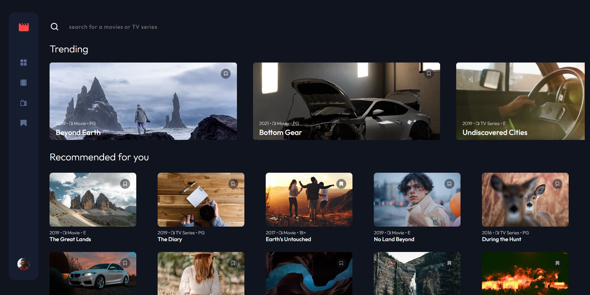
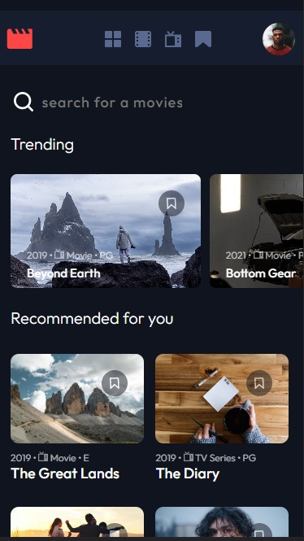
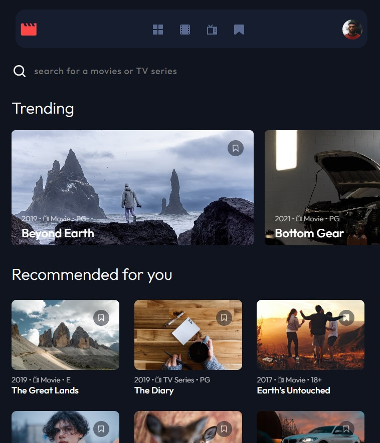

# Entartainment web app Challenge

This is a solution to the [Entertainment web app challenge on Frontend Mentor](https://www.frontendmentor.io/challenges/entertainment-web-app-J-UhgAW1X). Frontend Mentor challenges help you improve your coding skills by building realistic project.

## Table of contents

- [Overview](#overview)
  - [The challenge](#the-challenge)
  - [Screenshot](#screenshot)
  - [Links](#links)
- [My process](#my-process)
  - [Built with](#built-with)
  - [What I learned](#what-i-learned)
  - [Useful resources](#useful-resources)
- [Author](#author)

### The challenge

Users should be able to:

- View the optimal layout for the app depending on their device's screen size
- See hover states for all interactive elements on the page
- Navigate between Home, Movies, TV Series, and Bookmarked Shows pages
- Add/Remove bookmarks from all movies and TV series
- Search for relevant shows on all pages
- **Bonus**: Build this project as a full-stack application
- **Bonus**: If you're building a full-stack app, we provide authentication screen (sign-up/login) designs if you'd like to create an auth flow

### Screenshot

### Links

- Solution URL: [Github](https://github.com/batonitamazi/entertainment-web-app)
- Live Site URL: [live](https://app.netlify.com/sites/precious-smakager-0df611/overview)

## My process

### Built with

- Semantic HTML5 markup
- CSS custom properties
- Flexbox
- Mobile-first workflow
- [React](https://reactjs.org/) - JS library
- [ReduxToolkit](https://redux-toolkit.js.org/) - React Library

### What I learned
redux toolkit, also using global storage, reducers and actions in with redux toolkit, responsive design patterns

### Useful resources

- [Example resource 1](https://redux-toolkit.js.org/) - This helped me to create global Storage inside my application

## Author

- Github - [@batonitamazi](https://github.com/batonitamazi)
- Linkedin - [@tamazimirianashvili](https://www.linkedin.com/in/tamazi-mirianashvili-735600210/)